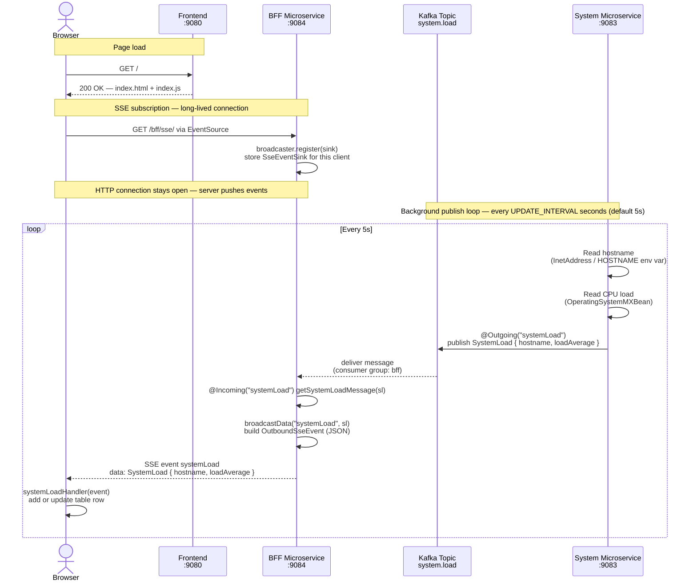

# Microservice Interaction Sequence Diagram

## Overview

This guide demonstrates a reactive SSE pipeline spanning three services:

- **Event-driven** (Apache Kafka / MicroProfile Reactive Messaging): System Microservice → BFF Microservice
- **Server-Sent Events (SSE)**: BFF Microservice → Browser (Frontend)
- **Static web serving**: Frontend → Browser

## Services

| Service             | Port | Role                                                                                     |
| ------------------- | ---- | ---------------------------------------------------------------------------------------- |
| System Microservice | 9083 | Publishes CPU load metrics to Kafka every 5 seconds (configurable via `UPDATE_INTERVAL`) |
| BFF Microservice    | 9084 | Consumes metrics from Kafka; broadcasts them to browser clients over SSE                 |
| Frontend            | 9080 | Serves the static HTML/JS page; the JS subscribes to the BFF SSE endpoint                |

## Kafka Topics

| Topic         | Producer            | Consumer         | Payload             |
| ------------- | ------------------- | ---------------- | ------------------- |
| `system.load` | System Microservice | BFF Microservice | `SystemLoad` (JSON) |

---

## Sequence Diagram



---

## Key Design Details

### System Microservice → Kafka

- `SystemService.sendSystemLoad()` is annotated with `@Outgoing("systemLoad")` and returns a `Publisher<SystemLoad>` driven by `Flowable.interval(updateInterval, TimeUnit.SECONDS)`.
- The emission interval is externalized via `@ConfigProperty(name = "UPDATE_INTERVAL", defaultValue = "5")`, allowing per-environment tuning without recompilation.
- `Flowable.interval` is back-pressure-aware: the MicroProfile Reactive Messaging runtime controls the consumption rate, preventing unbounded buffering.

### Kafka → BFF (Reactive Messaging)

- `BFFResource.getSystemLoadMessage()` is annotated with `@Incoming("systemLoad")`. The runtime calls it for each deserialized `SystemLoad` message — no polling or offset management in application code.
- The BFF's consumer group (`group.id=bff`) isolates its offset tracking from other consumers (e.g., the integration test's `system-load-status` group), so both can receive the same messages independently.

### BFF → Browser (SSE)

```
GET /bff/sse/
        │
        ▼
subscribeToSystem(@Context SseEventSink sink, @Context Sse sse)
        │  broadcaster = sse.newBroadcaster()  (created on first connection)
        │  broadcaster.register(sink)
        │
        ▼  [long-lived HTTP connection — server pushes events]

@Incoming("systemLoad") getSystemLoadMessage(sl)
        │
        ▼
broadcastData("systemLoad", sl)
        │  sse.newEventBuilder().name("systemLoad").data(...).mediaType(JSON).build()
        │  broadcaster.broadcast(event)
        │
        ▼  [event: systemLoad\ndata: {"hostname":"…","loadAverage":…}\n\n]

Browser EventSource → systemLoadHandler(event)
```

`SseBroadcaster` handles fan-out to all connected browser tabs in a single `broadcast()` call and automatically removes sinks when clients disconnect.

### Browser (Frontend)

```javascript
var source = new EventSource("http://localhost:9084/bff/sse", {
  withCredentials: true,
});
source.addEventListener("systemLoad", systemLoadHandler);
```

`EventSource` maintains a persistent HTTP connection and fires `systemLoadHandler` whenever an `event: systemLoad` frame arrives. `{ withCredentials: true }` pairs with the BFF's `allowCredentials="true"` CORS policy, which is required because Frontend (9080) and BFF (9084) are different origins.

### Channel → Kafka Topic Binding

```
System Microservice                       BFF Microservice
@Outgoing("systemLoad")             @Incoming("systemLoad")
        |                                   |
        | microprofile-config.properties    | microprofile-config.properties
        v                                   v
mp.messaging.outgoing              mp.messaging.incoming
  .systemLoad.topic=system.load      .systemLoad.topic=system.load
  .systemLoad.connector=liberty-kafka .systemLoad.connector=liberty-kafka
                  \                       /
                   \                     /
                    [  Kafka: system.load topic  ]
```

### Data Model

```
SystemLoad
├── hostname:     String   (e.g. "system-service-host-abc")
└── loadAverage:  Double   (-1.0 if the OS does not support measurement)
```

`SystemLoad` is serialized to JSON bytes by `SystemLoadSerializer` (producer side) and deserialized by `SystemLoadDeserializer` (BFF side). Both are static inner classes backed by Jakarta JSONB, co-located with the model in the shared `models` module.
